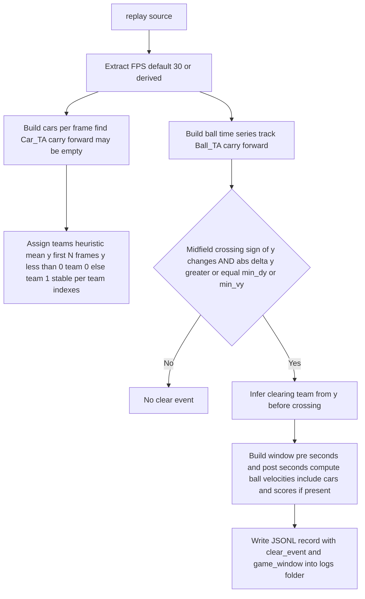
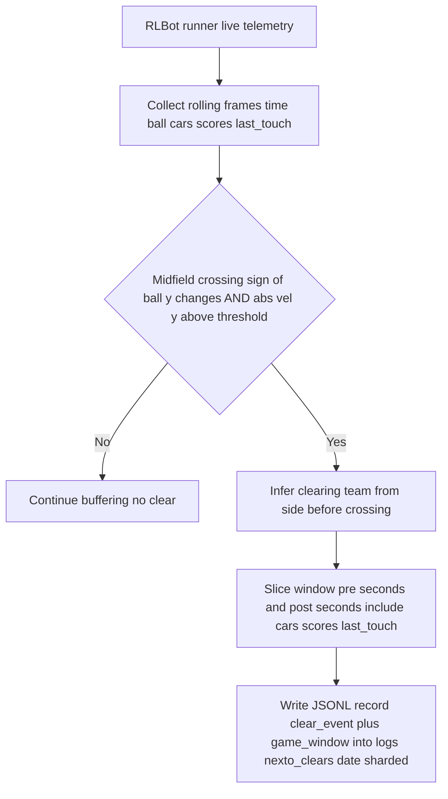
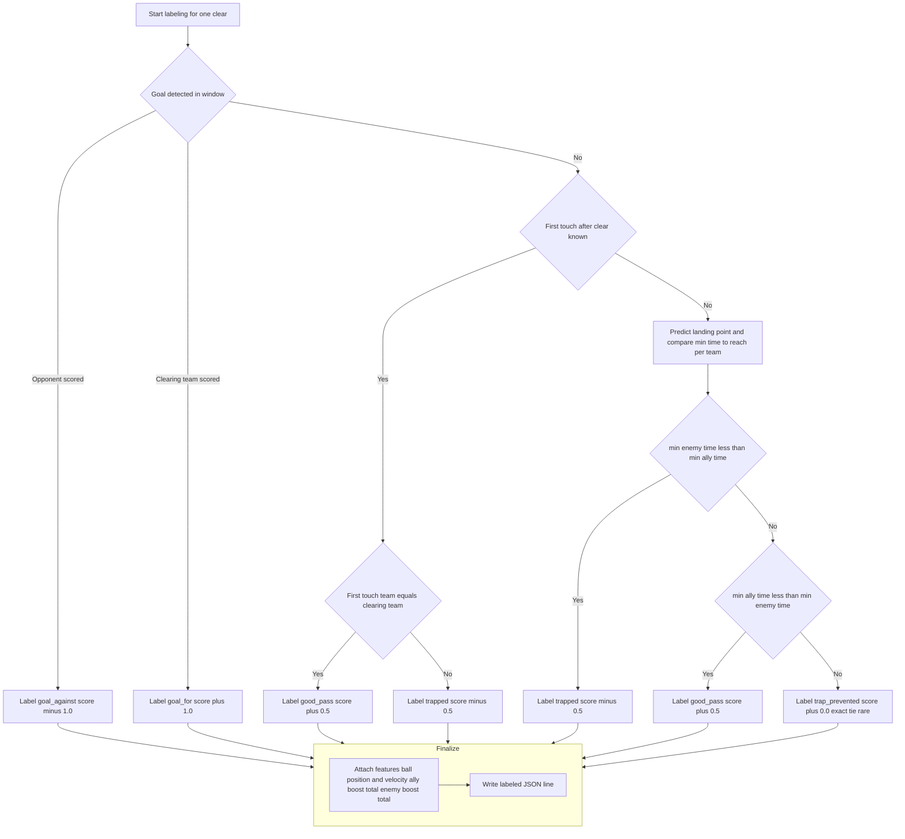

# Nexto Clear Logic — Decision Diagrams (Live bot games and Replay-based)

Two detection paths and one labeling path:
- Clear Detection from replay files (using rattletrap helper)
- Clear Detection from live bot games (RLBot runner)
- Clear Labeling (how labels are assigned)

---

## 1A) Clear Detection — Replay files (tools/rattletrap_to_clears.py)

Notes:
- tools/rattletrap_to_clears.py reads rattletrap JSON dumps
- tools/replay_to_clears.py can read .replay via carball
- Some versions omit cars or last_touch for robustness; labeling falls back gracefully

---

## 1B) Clear Detection — Live bot games (RLBot runner via run.py)

Notes:
- Live events are produced while running bot games using run.py and RLBot runner
- Output is sharded in rlbot-support/Nexto/logs as nexto_clears_YYYY-MM-DD.jsonl
- Per frame blue_score and orange_score and last_touch may be populated

---

## 2) Clear Labeling (rlbot-support/Nexto/label_clears.py)

Priority:
1) Goals override everything
2) Else first touch after clear
3) Else predicted arrival to landing point
4) No post label score adjustments

### Implementation details (from rlbot-support/Nexto/label_clears.py)

- Labels emitted: good_pass, trapped, goal_for, goal_against, trap_prevented (rare exact-tie case).
- Goal detection:
  - Prefer score deltas observed per frame in window (blue_score/orange_score). If blue increases, treat as team 0 goal; if orange increases, team 1 goal. Map to who_scored relative to clearing_team.
  - Fallback when scores are absent/unchanged: inspect last frame only. If ball.y > 5100 (GOAL_Y) consider a goal for orange (team 1); if ball.y < -5100, goal for blue (team 0).
- First touch after clear:
  - Walk window in time order looking at last_touch. A new touch is when player_index or time_seconds changes from the previous seen touch.
  - The first such new touch with state.time >= clear_time is taken as the first_touch_after_clear.
- Landing point used for ETA fallback:
  - Use the first frame strictly after clear_time; if none, use the last state’s ball position as landing_point.
- Time-to-reach model per car:
  - Base time = straight-line distance to landing_point divided by CAR_MAX_SPEED (2300 uu/s).
  - If boost < 20, multiply time by 1.2.
  - If the car’s facing direction is > 90 degrees away from the vector to the ball (based on rot_yaw forward vector), multiply time by 2.0.
  - Team minima (min_ally, min_enemy) are compared to decide trapped vs good_pass when no touch info is available; exact tie yields trap_prevented.
- Scoring weights:
  - goal_for: +1.0, goal_against: -1.0.
  - good_pass: +0.5, trapped: -0.5.
  - trap_prevented: +0.0.
  - No additional post-label score adjustments.
- Feature extraction:
  - Pick frame closest to clear_time; velocities default to 0.0 if absent.
  - features includes: ball_x, ball_y, ball_z, vel_x, vel_y, vel_z, ally_boost_total, enemy_boost_total.
  - Also attaches landing_point to each labeled JSON line.
- Constants defined: GOAL_Y = 5100, GROUND_Z = 18 (not currently used in labeling), CAR_MAX_SPEED = 2300.

---

## ASCII fallback

Clear Detection — Replay:
- Replay source
  -> Extract FPS (default 30 or derived)
    -> Build ball series (track Ball_TA, carry forward)
    -> Build cars per frame (find Car_TA, carry forward, may be empty)
      -> Assign teams (mean y first N frames: y less than 0 -> team 0, else team 1; stable per team indexes)
- If midfield crossing (sign of y changes AND abs delta y greater or equal threshold or abs vel y above threshold):
  -> Infer clearing team from y before crossing
  -> Build window (pre and post seconds), compute ball velocities, include cars and scores if present
  -> Write JSONL { clear_event, game_window } into logs

Clear Detection — Live bot games:
- RLBot runner live telemetry
  -> Collect rolling frames with time, ball, cars, scores, last_touch
- If midfield crossing (sign of y changes AND abs vel y above threshold):
  -> Infer clearing team from side before crossing
  -> Slice window (pre and post seconds), include cars, scores, last_touch
  -> Write JSONL { clear_event, game_window } sharded by date in logs

Clear Labeling:
- If goal in window:
  - Opponent scored -> label goal_against, score -1.0
  - Clearing team scored -> label goal_for, score +1.0
- Else if first touch after clear known:
  - If same team as clearing -> good_pass, score +0.5
  - Else -> trapped, score -0.5
- Else fallback by predicted arrival to landing point:
  - If enemy faster -> trapped, score -0.5
  - If ally faster -> good_pass, score +0.5
  - If exact tie -> trap_prevented, score +0.0
- No post label score deductions are applied
- Attach features (ball pos and vel, ally boost total, enemy boost total), write labeled line
